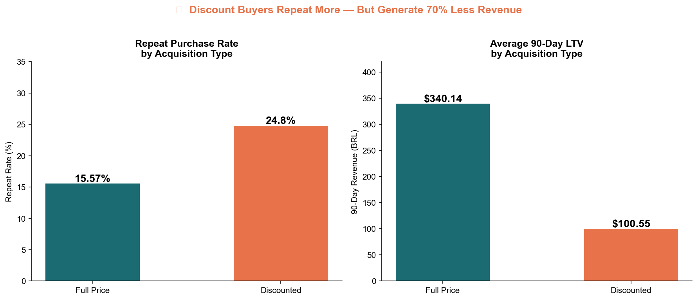

# Retail Promotion Effectiveness Analysis

> Do promotional discounts drive long-term customer value — or train customers to wait for sales?

## 📊 Live Dashboard
[View on Tableau Public](https://public.tableau.com/app/profile/karishma.mehta8733/viz/RetailPromotionEffectivenessOlistAnalysis/Dashboard1)

## Key Findings
- Discount-acquired customers generate **$74 vs $289** in 90-day revenue — a 74% gap (person-level, n=92,098 customers)
- OLS regression: discount acquisition is associated with **–160 BRL** in 90-day revenue after controlling for category, seasonality, and freight (p<0.001, n=91,159)
- Finding is **robust** — holds under a strict discount definition (bottom 25th percentile of category price: –92 BRL, p<0.001)
- Repeat purchasing is structurally rare at Olist (**~3% of customers**, nearly identical across acquisition types) — so discounting doesn't cause churn; it **attracts low-spend, one-time customers** in the first place
- Observational data with a price-based discount proxy — read effects as *associations*, not causal estimates; a pricing A/B test is the right next step

## Data Correction (Jul 2026)
An earlier version keyed customer analysis on `customer_id`, which in Olist is unique **per order** — the person-level key is `customer_unique_id`. After correcting the join key:
- The core LTV finding **strengthened** (gap widened from 70% to 74%; regression coefficient essentially unchanged at –160 BRL)
- The RFM/churn claims were **retracted**: apparent "repeat purchases" were multi-item orders, and true repeat rates are ~3% for both acquisition groups

## Tools & Methods
SQL · Python (Pandas, Statsmodels, Seaborn) · Tableau

## Methods Used
- SQL ETL pipeline joining 5 tables across 100k+ orders
- OLS regression with category, seasonality, and freight controls
- RFM customer segmentation
- Robustness check under strict discount definition (bottom 25th percentile)

## Dataset
Olist Brazilian E-Commerce — [Kaggle](https://www.kaggle.com/datasets/olistbr/brazilian-ecommerce)
100k+ orders, 42 product categories, 2016–2018
*Raw data not included in repo — download from Kaggle link above*

## Structure

The SQL is split into two versions. **Run the second one.**

| Folder | What it is |
|---|---|
| [`/sql/01_original_sqlite`](sql/01_original_sqlite) | the original SQLite pass — kept for history, carries known join defects |
| [`/sql/02_mysql_rebuild`](sql/02_mysql_rebuild) | **current.** Rebuilt in MySQL from raw CSVs, verified stage by stage |
| `/notebooks` | EDA, regression, RFM (built on v1; correction banners at top) |
| `/tableau` | flat exports feeding the dashboard |
| `/output` | charts and dashboard screenshots |
| `/clean` | processed CSVs |
| [`PROJECT_BRIEF.md`](PROJECT_BRIEF.md) | 2-page write-up: objective, method, findings, limitations |

Each SQL folder has its own README explaining what's inside and, for the
rebuild, the expected row count at every stage.

## Business Question
Do promotional discounts drive long-term customer value at Olist — or do they attract one-time buyers and erode margins?

## Recommendation
Olist's discounting strategy generates transaction volume without generating customer value. Electronics and food_drink are priority targets for promotional restructuring based on high discount rates (75–76%) and the lowest 90-day customer revenue of any major category ($74–85 vs $141 average).